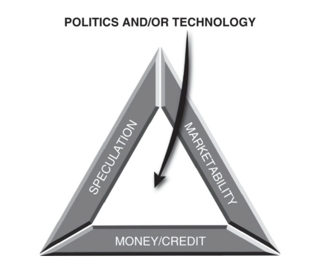

# Boom & Bust
## Participant Guide

Turner & Quinn's *Boom and Bust: A Global History of Financial Bubbles*

---

## Modern Bubble Analysis

### Choose a Trend

Your small group selects one current trend to analyze:

Generative AI • Climate tech • Private credit • Quantum computing  
GLP-1s • Longevity biotech • Sovereign wealth concentration  
*Or choose your own*

### Bubble Triangle Analysis

Analyze your chosen trend:

**Fuel**  
What's driving abundant resources into this space?

Low rates? Capital concentration? Sovereign activity? Regulatory tailwinds? Tech breakthrough?

**Marketability**  
What makes this trend easy to trade, share, or access?

Fundraising ease? Distribution channels? ETF/SPV access? Narrative strength?

**Speculation**  
Where is speculative psychology visible?

Narrative momentum? Founder cults? Impossible TAM? Retail FOMO? Valuation disconnects?

### Worksheet

**Trend/Sector:** ___________________________

**Fuel**  
What's driving resources into this space?

  

**Marketability**  
What makes this trend easy to trade/share/access?

  

**Speculation**  
Where is speculative psychology visible?

  

**Scorecard**

| Component | Score (1–5) | Evidence |
|-----------|-------------|----------|
| Fuel | |    |
| Marketability | |    |
| Speculation | |    |
| **Total** | | |

**Productive or destructive bubble?**

   

### Group Presentation

Present your trend, scorecard, and productive/destructive assessment.

---

## Bubble Antidote Builder

### Small Groups

For your trend, design one antidote strategy:

**Signal Check**  
What early-warning signs would show speculation is outrunning fundamentals?

*Examples: TAM > global GDP • 3+ competitors at 100x revenue*

**Underwriting Shift**  
What hype-resistant decision criteria would you adopt?

*Examples: Profitability path within 24 months • Discount hot-sector comps 50%*

**Balanced Conviction**  
What does bubble-aware but opportunity-positive positioning look like?

*Examples: Infrastructure, not speculation • Position-size for 70% drawdown*

### Worksheet

**For trend/sector:** ___________________________

Choose one approach:

**[ ] Signal Check**  
Early-warning signs that speculation outpaces fundamentals

  

**[ ] Underwriting Shift**  
Hype-resistant decision criteria

  

**[ ] Balanced Conviction**  
Bubble-aware but opportunity-positive positioning

  

**Our antidote:**

   

### Full Group Discussion

Share your antidote with the full group.

Discuss: "Which antidotes apply across all investment decisions?"

---

## The Bubble Triangle of You

### Individual Reflection

Map your personal Bubble Triangle:

**Your Fuel**  
What environments make you accelerate?

*Early momentum in data • Abundant capital for experiments • Competitive pressure • etc.*

**Your Marketability**  
What parts of your work strengthen when shared or visible?

*Public pitching improves ideas • Leadership visibility drives performance • Need external validation • etc.*

**Your Speculation Risks**  
Where do you tend toward overconfidence or FOMO?

*Chase hot opportunities outside competence • Overestimate timing ability • Can't say no when peers are enthusiastic • etc.*

### Group Discussion

Share voluntarily. Discuss:

**Team Overlaps**  
Where do multiple people share the same patterns?

*"Three of us need competitive pressure—are we vulnerable to herd behavior?"*

**Organizational Strengths/Risks**  
What patterns emerge at the team level?

*"We're marketability-driven—strong on narrative, weak on contrarian conviction."*

**Collective Productive Bubble Potential**  
How could we harness our strengths while guarding against risks?

*"We could build AI infrastructure (Fuel + Marketability) if we add speculation guardrails."*

---

*Workshop based on Turner & Quinn's Boom and Bust: A Global History of Financial Bubbles*
